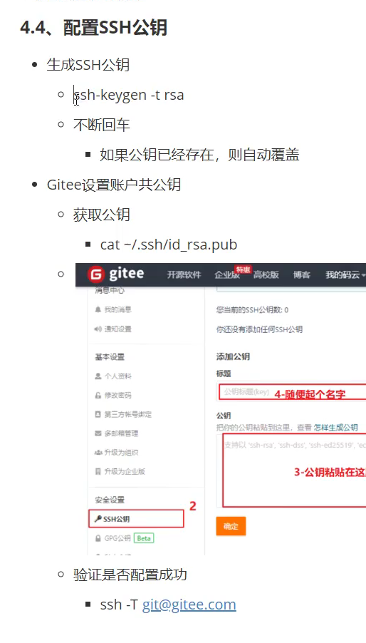
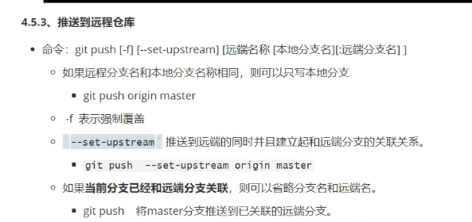

### git
git是分布式版本控制系统
svn是集中式版本控制系统
1. 更改用户名和邮箱在cmd
```
 1. 设置账户名和邮箱
 git config --global user.name "kntwo"
 git config --global user.email 3057505161@qq.com
 查看
 git config --global user.name
 git config --global user.email
 修改git-log
 alias git-log='git log --pretty=oneline --all --graph --abbrev-commit'
 source ~/.bashrc
2. 关闭ssl
 git config --global http.sslVerify false
 ```
 重点: 远程仓库和本地仓库
 仓库(repository)<-暂存区(index)<-工作区(workspace)
 git bash和git gui
 1. ls/ll cat touch
#### git指令
1. git init
2. git status
3. git add .
4. git commit -m "message"
5. git log
6. git-log
7. git reset --hard cimmitid 回退版本
8. git reflog  版本的操作
Vim有三种模式，第一种普通模式是刚打开那样，第二种是输入i进入输入模式，第三种是输入：进入命令模式。三种模式用esc来切换，不能直接在输入模式时输入：进入命令模式
8. mv(重命名) vi(编辑) :Wq(退出并保存) :q(只退出)
9. clear(清空)
10. .gitignore文件添加要忽略提交的文件
11. git checkout 切换分支
12. git checkout -b
13. git merge
14. git branch -d 删除分支
15. git branch -D
16. git branch -vv  查看本地分支与远程仓库的联系
17. git branch 查看本地分支
18. 配置公钥ssh
    
    最后为github的方法 
    ```ssh -T git@github.com```
    链接不上就关闭系统防火墙
    最后输入yes确定
18. git remote add origin 仓库地址
19. git rm (远程仓库名) 删除远程仓库
20. git remote   查看远程仓库
21. git push --set-upstream origin 本地分支名:远程分支名
    
    之后就用git push 就可以了.
22. git branch -m master main 更改分支名
23. git fetch 抓取 get merge 合并
24. git pull 拉取=抓取+合并
25. git clone 仓库地址
26. find . -name ".git" | xargs rm -Rf (git仓库的删除)
27. ll -d ~/  (查找.ssh文件)
28. git config user.name
29. git config user.email
##### git gitignore的忽略文件
1. node_modules    忽略node_modules的单文件  
2. *.zip            表示忽略所有 .zip结尾的文件
3. /dist          忽略项目根目录下的 dist 文件夹,但不包括子目录下的dist文件夹
4.  build/          忽略 build/目录下的所有文件，包括子目录下的文件
