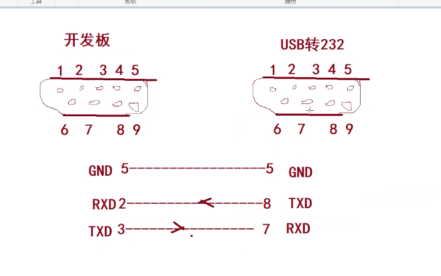
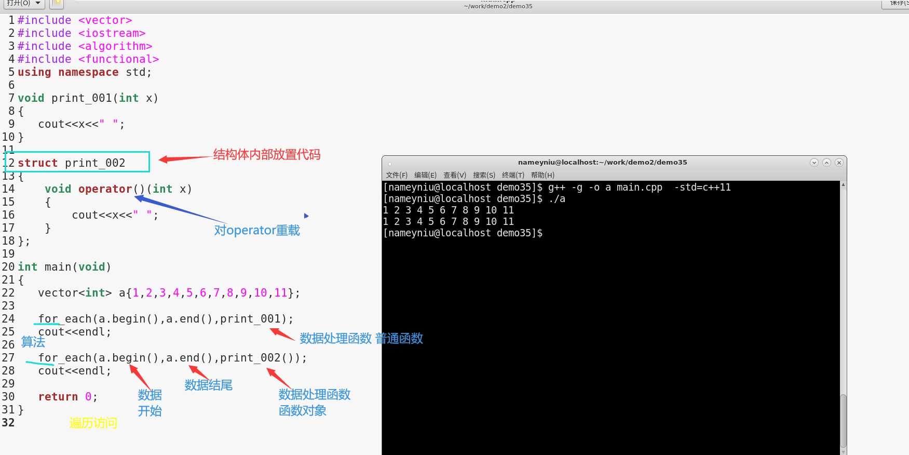
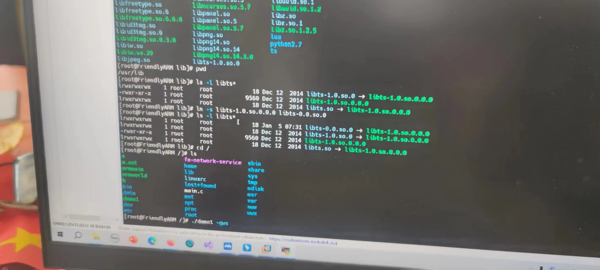
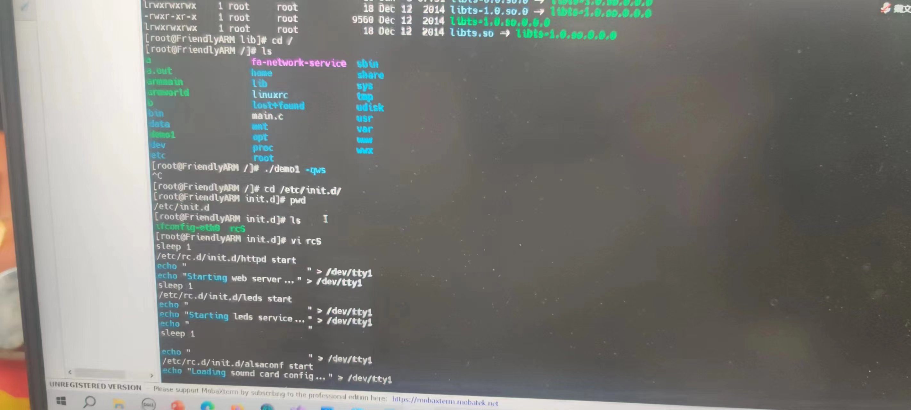

#### day1
1. 虚函数
   1. 纯虚函数 含有纯虚函数的类是抽象类
不能实例化对象
   2. 虚函数and纯虚函数[link](https://www.runoob.com/w3cnote/cpp-virtual-functions.html)
2. 
   1. export PATH=$PATH:/usr/local/arm/4.5.1/bin
   2. gmake -j4 四个线程安装
3. 异常处理throw catch try
#### day3
```c++
    template<typename T>//函数模板
    template<class T>//类模板
```
red---power
earth----black

#### day4

#### day5
1. ./demo -qws   在开发板运行
2. 开发板调整


ctrl + c 退出程序

