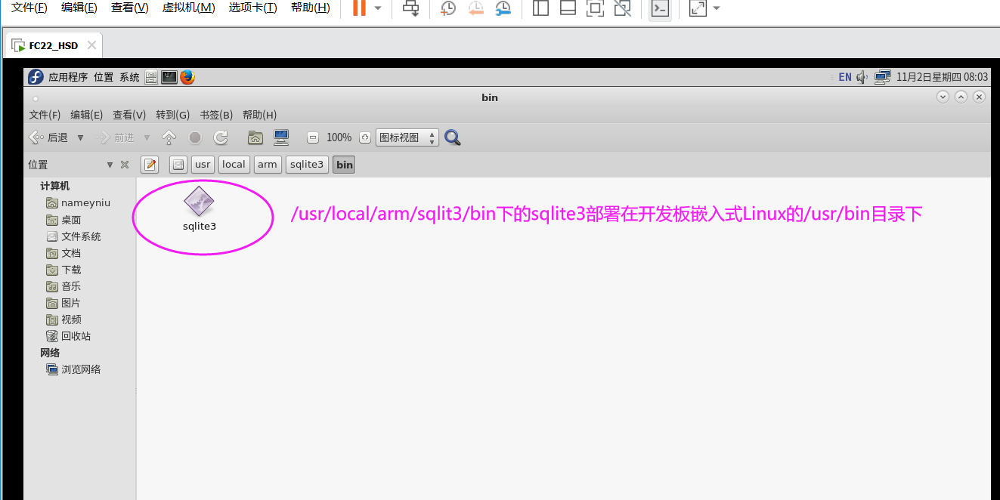

#### day1
1. 自定义信号和槽函数
   1. connect,
2.  触摸屏
   1. cd /etc/init.d/rcS  
   2. /bin/qt4  
3. ctrl 复制ui
4. QLatin1String()  将char* 转qstring//没中文
5. str.toAscii()  Qstring转成char*     Sstring::fromutf8(str) ;char* 转qstring 有中文  
6. line edit or text edit 单行 or 多行
#### day2
7. 配置键盘
8. 
   
#### day3
9.  qmessagebox
10. 设置编码
11. splashscreen
12. splash movie
#### day4 
1. sqlite3移植开发板

2. 调试
   echo 0 | tee /proc/sys/kernel/yama/ptrace_scope