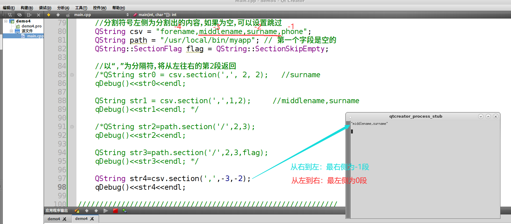

#### day1

#### day2
1. layout
2. dradient
3. 多线程和网络
   1. QThread::sleep(10);里面是秒只有继承于QThread才能用
   2. 在一个线程进行生产或消费时，其余线程不能再进行生产或消费等操作，即保持线程间的同步
   3. 线程互斥
   4. nc -l Port        ,nc ipaddress Port //netcat tcp
   5. nc -l -u Port  ,nc -u ipaddress Port  //udp    -l listen
   6. 套接字Socket=（IP地址：端口号）