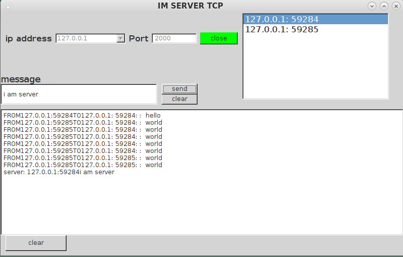
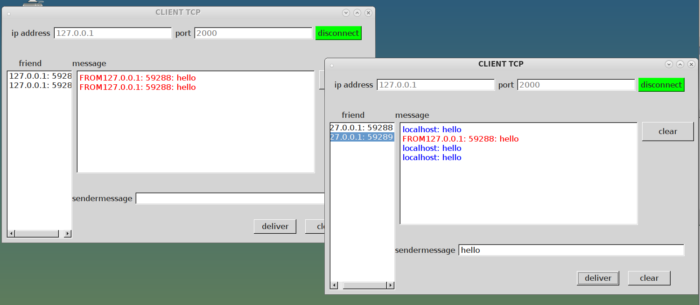
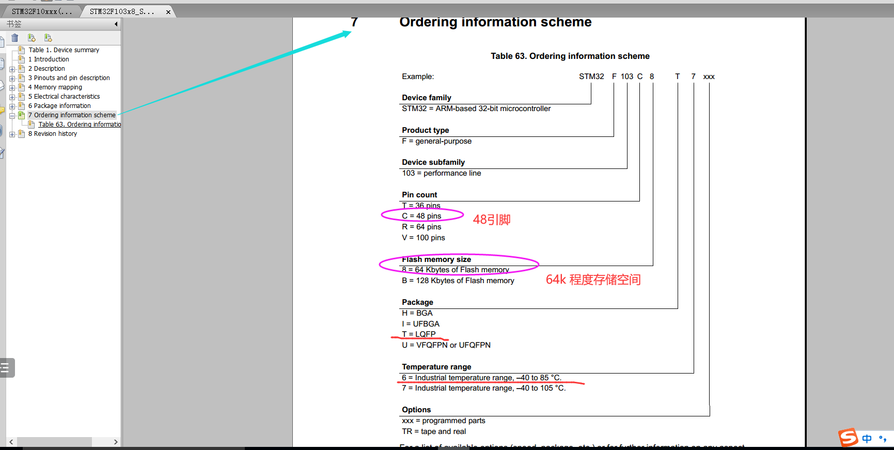
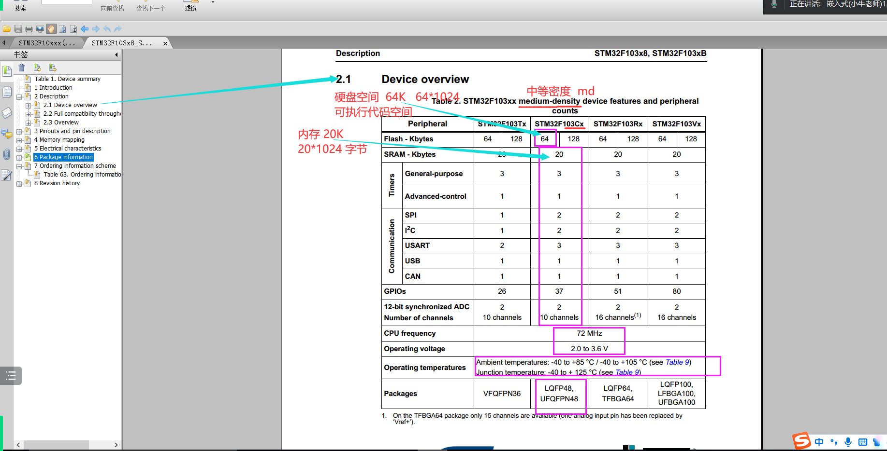
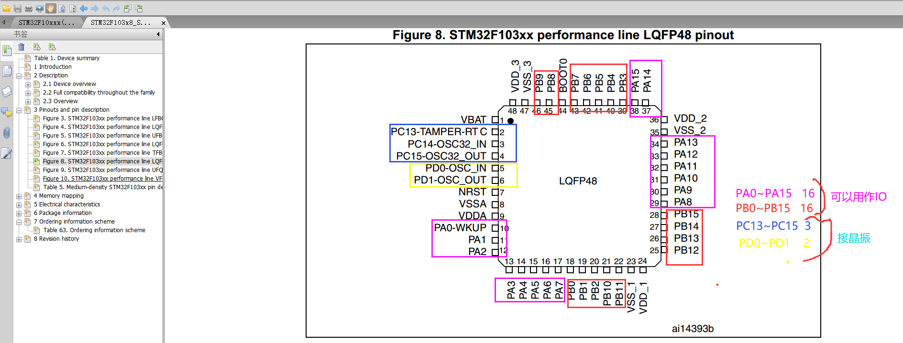

#### 项目IM(局域网实时通信)--基于TCP
##### 功能与演示
1. 服务端有所有已连接的ip信息并记录所有主机的聊天记录
   
2. 客户端也显示已连接的ip信息
3. 客户端之间可以互相通信且显示实时在线主机
   
   1. 可以选中进行通信
##### 代码截屏与解释
```c++
    //使用数据库存储在线主机
    db=QSqlDatabase::addDatabase("QSQLITE");
    db.setDatabaseName("group.db");
    if(db.open()){
        QSqlQuery query;
        query.exec("create table if not exists online(ip,port);");
        query.exec("delete from online;");
    }else{
        qDebug()<<"db open fault";
    }
```
```c++
    //处理数据
    ui->listWidget->clear();
    QList<QByteArray> messages = ba.split('\n');
    foreach(QByteArray message , messages) {
        if (message.startsWith("QUERY_RESULT ")) {
            QByteArray resultData = message.mid(13);
            ui->listWidget->addItem(QString::fromLocal8Bit(resultData));
        }
    }
```
#### stm32
1. STM32F103C8T6
   1. 公司 32-bit c8 t6
   2. 
   3. 
   4. 
2. 100mil ==2.54 mm
3. 操作外设需要先使能否则无效