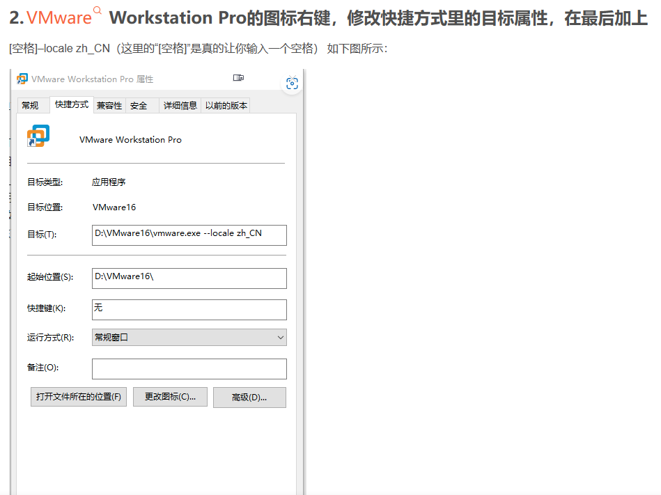
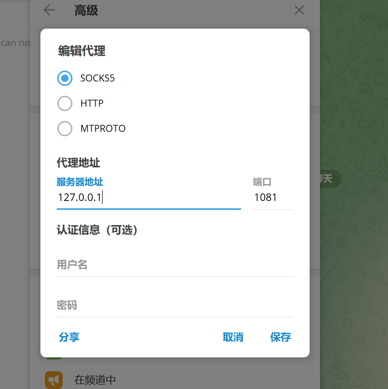

# notes
### 这是一些常用命令 etc
1. wmic memphysical get maxcapacity  (电脑支持的最大内存cmd)
2. ipconfig(cmd ip地址查询)
3. alt+f4 (被骗 用来关闭应用程序)
4. 字符集的问题
   
5. ipconfig /flushdns(刷新dns缓存和浏览器)
6. ffmpeg -i 视频文件名 -i 音频文件名 -c:v copy -strict experimental 输出文件名(合并b站下载的音频视频)
7. ffmpeg -i input1.mp3 -i input2.mp3 -filter_complex amerge -ac 2 -c:a libmp3lame -q:a 4 output.mp3(合并两端音频)
8. JU090-6039P-08409-8J0QH-2YR7F(vm密钥)
   改中文
9. 
10. fusionos: administrator XUWENYIYI123456q!
   user :305750!kn
11. [VMware虚拟机三种网络模式：桥接模式，NAT模式，仅主机模式](https://www.cnblogs.com/bushilushan/p/17085712.html#t1)
12. hostnamectl set-hostname node2
13. wsl -d Ubuntu
wsl --list --verbose
wsl --list --online
wsl --install Ubuntu-22.04
<DistributionName> config --default-user <Username>
wsl --shutdown
wsl --terminate <Distribution Name>
wsl -d Ubuntu-20.04
wsl --set-default <Distribution Name>

Inside the instance, as root, create/edit /etc/wsl.conf and add these lines:
[user]
default=username

14. vnc 可以给服务器添加界面
15. 对方要检查本地的公钥,有我的公钥,我才可以用本地的私钥登陆它

#### mc fabric 开服教程
Java环境 
<!-- java -Xmx2G -jar fabric-server-mc.1.20.6-loader.0.15.11-launcher.1.0.1.jar nogui -->
curl -OJ https://meta.fabricmc.net/v2/versions/loader/1.20.4/0.15.11/1.0.1/server/jar

java -jar fabric-server-mc.1.20.4-loader.0.15.11-launcher.1.0.1.jar server -mcversion 1.20.4 -downloadMinecraft

java -Xmx4G -server -Dfile.encoding=UTF-8 -Duser.language=zh -Duser.country=CN -jar installer.jar

sudo firewall-cmd --list-ports
sudo firewall-cmd --zone=public --add-port=25565/tcp --permanent
sudo firewall-cmd --reload
screen -ls
screen -r minecraft
screen -X -S minecraft quit

ctrl+A再按D退出会话
cat /proc/cpuinfo

MSPT（Milliseconds Per Tick，每刻毫秒）是一个关键性能指标，用于衡量服务器处理每个刻（Tick）所需的时间。理想情况下，每刻应该不超过 50 毫秒，这样服务器才能维持 20 TPS（Ticks Per Second）。

### java
mvn clean install -P dev

##### nacos 
[安装指导](https://help.fanruan.com/finedatalink/doc-view-462.html)
sh startup.sh -m standalone
sh shutdown.sh
[项目使用指导](https://nacos.io/zh-cn/docs/quick-start-spring-boot.html)
openssl rand -base64 32
nacos mysql:root
305750xW!

### vue
css选择器:类选择器 .root, id选择器#root

vue实例与容器一一对应
插值语法,模板语法
加入v-bind 引号里变成表达式执行
v-model 表单类元素要有value

1. js构造函数和原型是用于创建和管理对象的两个关键概念。构造函数是一种特殊的函数，用于初始化对象，而原型则是构造函数的一个属性，它包含所有实例共享的方法和属性。通过在原型对象上定义方法，你可以确保所有通过该构造函数创建的对象实例都共享这些方法，而不是每个实例都各自拥有一个独立的方法副本，从而节省内存。