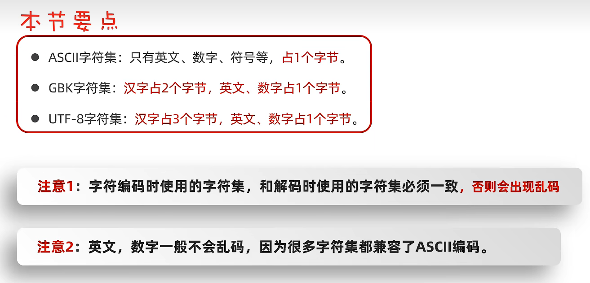

# notes
### 这是一些常用命令 etc
1. wmic memphysical get maxcapacity  (电脑支持的最大内存cmd)
2. ipconfig(cmd ip地址查询)
3. alt+f4 (被骗 用来关闭应用程序)
4. 字符集的问题
   
5. ipconfig /flushdns(刷新dns缓存和浏览器)
6. ffmpeg -i 视频文件名 -i 音频文件名 -c:v copy -strict experimental 输出文件名(合并b站下载的音频视频)
7. ffmpeg -i input1.mp3 -i input2.mp3 -filter_complex amerge -ac 2 -c:a libmp3lame -q:a 4 output.mp3(合并两端音频)
8. JU090-6039P-08409-8J0QH-2YR7F(vm密钥)
   改中文
9. 
10. fusionos: administrator XUWENYIYI123456q!
   user :305750!kn
