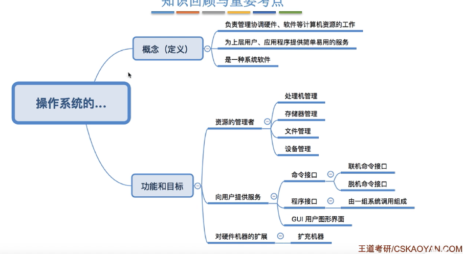
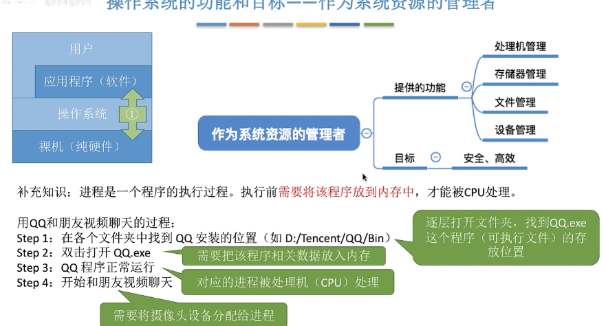
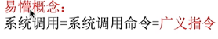
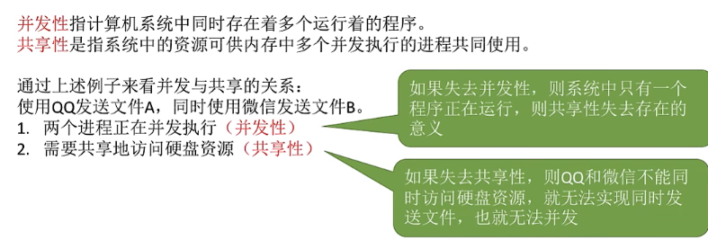
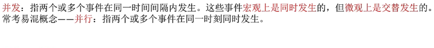
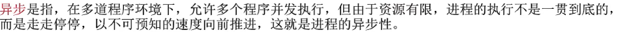

## OS/operating system
#### (1)操作系统的概念和目标

是系统软件
对硬件和软件进行管理

用户和计算机硬件之间的接口
1. 命令接口 用户可以直接调用
   1. 联机命令接口cmd
   2. 脱机命令接口(.bat)
2. 程序接口(.dll)通过程序间接调用
   由一组系统调用组成
   
3. GUI:图形用户界面
#### (2)操作系统的四个特征
*1和2是两个最基本的特征,二者互为存在条件*

1. 并发(了解与并行的区别)

2. 共享(系统资源)
   互斥共享方式和同时共享方式
往往是从宏观上看
3. 虚拟 依靠并发性
   空分复用技术(虚拟存储技术)
   时分复用技术(虚拟处理器技术)
4. 异步 也依靠并发性

 