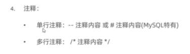
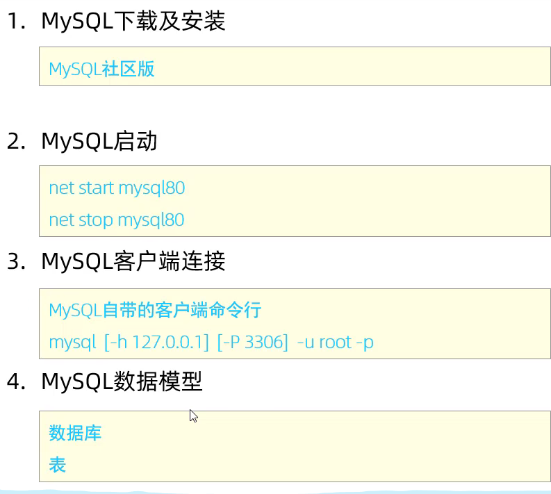

### mysql安装
yum install mysql
yum install mysql-devel
安装 mysql-server
wget http://dev.mysql.com/get/mysql80-community-release-el7-5.noarch.rpm
rpm -ivh mysql80-community-release-el7-5.noarch.rpm
yum install mysql-community-server
cat /var/log/mysqld.log | grep password

sudo yum clean all
yum update

mysql -u root -p(cmd)
mysql -h -P -u -p
quit(退出)


2. 执行 source sql文件
### SQL(结构化查询语言)关系数据库
###### 注释

###### 分类
1. 数据定义语言(DDL)
2. 数据操纵语言(DML)
3. 数据查询语言(DQL)
4. 数据控制语言(DCL)
###### 触发器
1. 查询已有[触发器](https://blog.csdn.net/weixin_40486955/article/details/103871901)
2. 同一模式下只能定义在基本表上 
3. 删除触发器  drop trigger if exists S1;
### MYSQL
#### start
1. 
2. 必须启动mysql服务然后通过客户端连接数据库管理系统
3. 一个数据库管理系统实例可以创建多个数据库
4. 一个数据库中可以创建多个模式
5. 一个模式中可以包括多个表等数据库对象
#### 数据类型
1. 数值类型 
2. 字符串类型
   1. trim(str);
3. 日期类型 
   1. sysdate() current_date() current_time() current_timestamp() now() date(datetime)
   2. 
#### 约束管理
列级别 表级别
1. primary key ,unique, not null,check,foreign key,default
2. 主键只能有一个 联合主键也是一个
   1. alter table table_name drop primary key;
   2. alter table table_name add primary key(column_name);
   3. auto_increment 为max+1
   4. alter table table_name auto_increment=100;
   5. alter table table_name modify column_name type;删除auto_increment
3. create table: column_name type unique;
   1. alter table table_name drop index index_name;
   2. alter table table_name add unique(age)
   3. unique can be NULL
4. create table: column_name type not null
   1. column_name is NULL
   2. column_name not NULL
5. create table: column_name type check(sex in('0','1'));  
6. create table: column_name type default '1';
7. 外键是表级别约束 create table: foreign key(subcolumn_name) references table_name(column_name);
8. constraint 别名 约束条件 可以给约束起名
#### 算术运算符
select salary*12 from table_name;
1. 列别名 select salary*12 as annualsalary from table_name;
2. 表别名 select * from table_name as alias_name;
    select alias_name.salary from table_name;
#### index
#### 事务
1. atom consistency isolation durable acid
#### 消除重复项
1. select distinct name frome table_name;
#### 条件查询
1. 可以包含运算符
2. select * from books where number>0;
3. 条件表达式可以用 and or 
4. select * from books where number!=0 and number!=45;
5. in 和  between and（闭区间） 区别
6. select * from books where number in(45);
7. select * from books where number between 1 and 100 and number not in(45);
8. 模糊查询 like
9. ifnull( , )函数
##### 通配符
1. % _
#### 排序查询
1. order by
#### 分组查询
1. 分组函数 max avg 等
2. group by
3. 分组查询列名必须在group by 中包含
4. having 后跟条件查询不用where
5. select sysdate(); 时间查询
6. datetime 和 date 数据类型可以用sysdate();
#### 多表查询(连接查询)
1. 笛卡尔积 通过添加条件消除笛卡尔积
2. sql92好用
3. 内连接
   1. 等价连接 和 非等价连接 两个表
   2. 自连接 一个表
4. 外连接
   1. left join和 right join 
   2. select yg.name,ld.name  from t_emp ld left outer join t_emp yg on yg.mgrid=ld.id;
#### 联合查询
1. union, union all
2. 可以两个表
3. select * from staff where age<10 union select * from staff where superiorid=1;
#### 分页查询
1. select * from staff limit 3,10;
2. 从0开始
#### 子查询
1. 一个sql语句可以多个子查询
2. 单行 > != = ...
3. 多行 in any all
4. 是否满足子查询的条件
5. having 后可以使用子查询
6. from 后面可以使用子查询
#### 增删改
1. update table_name set...
2. delete from table_name where...
   1. truncate与delete 的区别 truncate 不能rollback且不能添加条件即所有删除
3. insert into table_name...value(...) 
   1. insert into table_name(column1,..) select 语句
   2. insert ignore into ....
#### 基本操作
1. 数据库操作
    a) 查看所有的数据库
    i. show databases;
    b) 创建数据库
    i. Create database 数据库名;
    ii. Create database 数据库名 character set ‘字符集’
    iii. Create database if not exists 数据库名
    iv. Create database if not exists数据库名 character set ‘字符集’
    c) 查看字符编码
    i. show create database 数据库名;
    d) 修改数据库字符编码
    i. alter database 数据库名 character set ‘字符集’
    e) 查看当前使用的数据库
    i. select database();
    f) 切换数据库
    i. use 数据库名;
    g) 删除数据库
    i. drop database 数据库名;
    ii. drop database if exists 数据库名;
2. 创建用户
    a) Create user ‘用户名’@’host’ identified by ‘密码’
    i. 解读：host：表示该用户在哪个主机上可以登录，如果是本地用户则用localhost，如果远程访问则用 %
    b) 创建的用户存储在mysql数据库的user表里
3. 用户授权
    a) grant 权限 on 数据库名.表名 to ‘用户名’@’host’;
    i. 解读：权限：SELECT/INSERT/UPDATE/DELETE/CREATE/DROP/ALL 等
    ii. 例如：grant SELECT on student_db.* to ‘tom’@’locahost’
4. 查看用户当前权限
    a) show grants for ‘用户名’@‘host’
5.  撤销用户权限
    a) Revoke 权限 on 数据库名.表名 from ‘用户名’@’host’;
6.  删除用户
    a) drop user ‘用户名’@’host’
7.  创建用户的同时进行权限的设置（根据不同的数据库版本）
    a) Grant 权限 on 数据库.表 to ‘用户名’@‘登录主机’ identified by ‘密码’
8. ubuntu
GRANT ALL PRIVILEGES ON database_name.* TO  'new_user'@'localhost';
```sql
ALTER USER 'root'@'%' IDENTIFIED WITH mysql_native_password BY 'your_password';
FLUSH PRIVILEGES;
```
#### 表操作
1. 修改表结构
    a) 添加字段
    i. alter table 表名 add 列名 数据类型;
    b) 修改字段
    i. Alter table 表名 change 旧列名 新的列名 数据类型；
    c) 删除字段
    i. Alter table 表名 drop 列名；
    1. alter table 表明 modify column_name type; modify是改列的数据类型
2. 删除表
    a) drop table 表名
3. 改表名
   rename table table_name to new_name;
4. show create table table_name;
   显示define