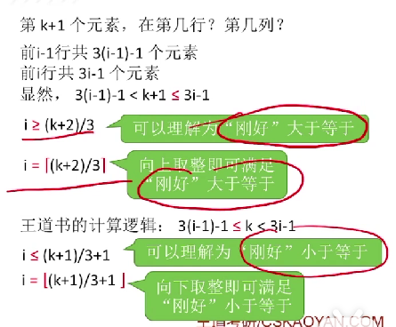
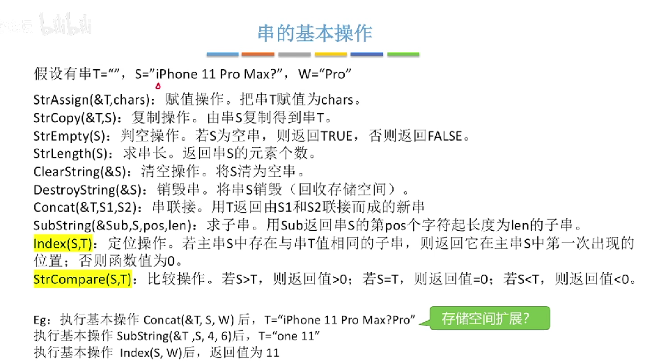
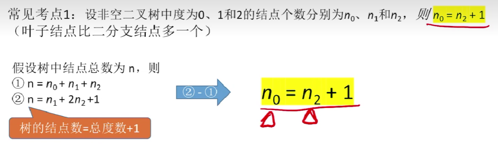
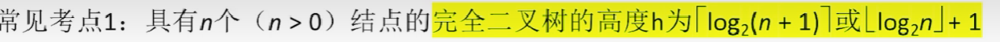
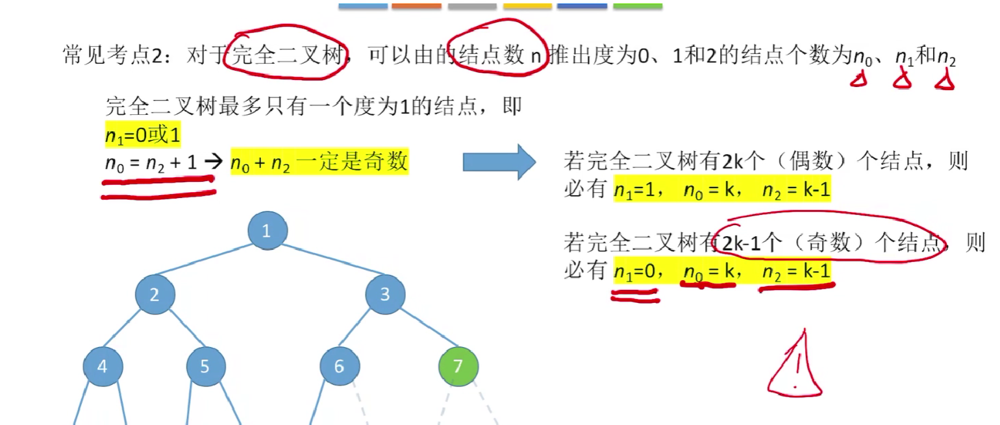
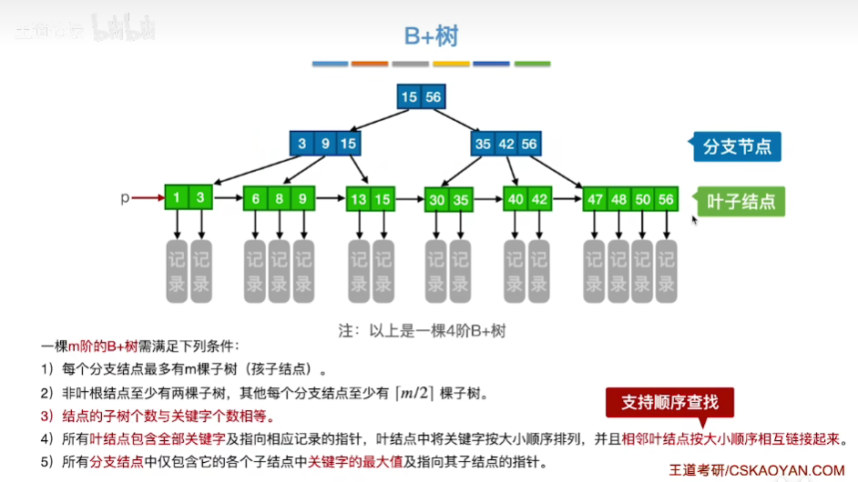

[toc]
#### *栈stack*
后进先出(LIFO)
#### *队列queue*
先进先出(FIFO)
sqQueqe sq是sequence顺序
typedef struct Qnode{}*queueptr;
等价于typedef struct Qnode *queueptr;
1. 列优先存储
2. 行优先存储 可以随机存取
### 矩阵的压缩存储
方阵和对称矩阵
##### 对称矩阵
策略:只存储主对角线+下三角区(上三角区)
一维数组长度$\frac{(1+n)*n}{2}$
##### 三角矩阵(三角区元素相同)
也用一维数组同样需要映射函数😂
##### *对角矩阵*(带状矩阵)
长度:3n-2  
|i-j|>1是0  
|i-j|<=1  

#### 稀疏矩阵
1. 顺序存储--三元组(struct)
2. 十字链表法
### 串
1. 在主串中的位置从1开始
2. 空串和空格串
3. 以子串为操作对象

*串的基本操作*
##### 二叉树性质

##### 二叉树的存储
1. 顺序存储
   1. 满二叉树
   2. 完全二叉树
   3. 普通二叉树 
2. 链式存储
##### 二叉树的遍历
1. 中序遍历(与另一种由遍历序列推二叉树)
2. 先序遍历
3. 后序遍历
4. 层序遍历
##### 线索二叉树
1. 前驱和后继
2. 先序线索二叉树 
3. 中序线索二叉树
4. 后序线索二叉树
##### 几个特殊的二叉树
满二叉树 完全二叉树 二叉排序树 **平衡二叉树**
##### 树 
1. 双亲表示法(顺序存储)
2. 孩子表示法(顺序+链式存储)
3. 孩子兄弟表示法(链式存储)重要
### 图
1. 最小生成树
### 第七章 查找
### B+树

