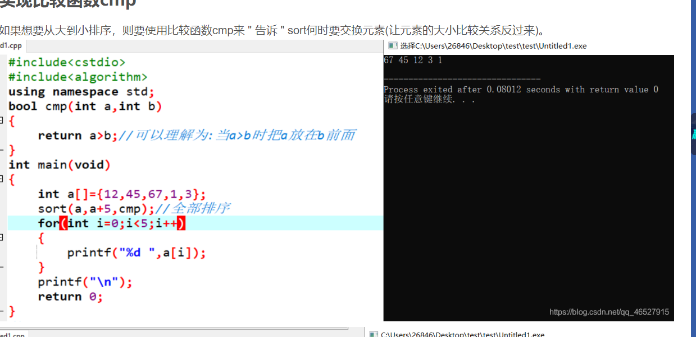
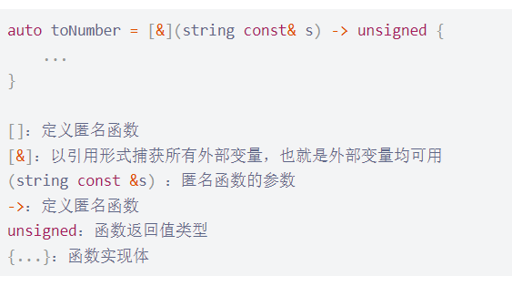
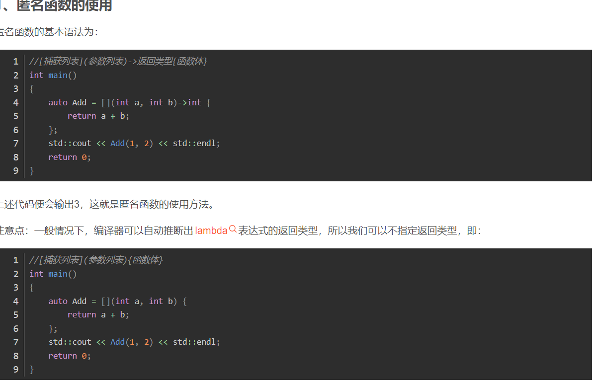
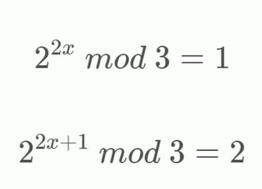

string的查找 find;
最短通路问题
dijkstra算法解决无向赋权图的问题
广度优先搜索算法求生成树
### 函数
1. isalpha函数
isalpha()函数用来判断一个字符是否为字母，如果是字母则返回非零，否则返回零。
2. isalnum函数
isalnum()函数用来判断一个字符是否为数字或字母，是则输出非零，否则输出零。
3. islower函数
islower()函数用来判断一个字符是否为小写字母。
4. isupper函数
isupper()函数用来判断一个字符是否为大写字母。
5. sort()函数

### auto
1. auto的原理就是根据后面的值，来自己推测前面的类型是什么。
auto的作用就是为了简化变量初始化，如果这个变量有一个很长很长的初始化类型，就可以用auto代替。
2. 如果是可用迭代器的对象的话，还可以这样操作：
``` c++
int main(){
    vector<int>v;
    v.push_back(1);
    v.push_back(2);
    v.push_back(3);
    for(auto i : v){
        cout<<i<<" ";
    }
    cout<<endl;
    return 0;
}
```
### sort 函数的使用以及[&]定义匿名函数


### for(auto : )的用法
在csdn收藏
4的幂
