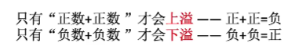
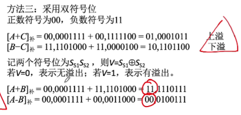

#### *存储器与cpu的协同工作*
1. 与操作系统存储管理联系
2. 
3. 字长是8的倍数
4. 高速缓存cache  三级缓存

1. 存储器容量的扩展
   1. 位扩展(增加存储字长)
   2. 字扩展(增加存储单元)片选输入端低电平有效
   3. 字,位扩展

#### rom
1. 掩膜ROM
2. PROM
3. EPROM(多次性编程)紫外线擦除麻烦

4. EEPROM
  电可擦除/局部擦除/全部擦除
5. flash memory(闪存)

#### *计算机的运算*
1. 溢出判断
   
   1.  采用一位符号位
   
   2.  异或计算进位
   
   3. 双符号位
   
   