## 计算机网络
## 第一章
### 重点
五层网络体系结构
各层之间的协议
典型的网络(以太网)
网络设备
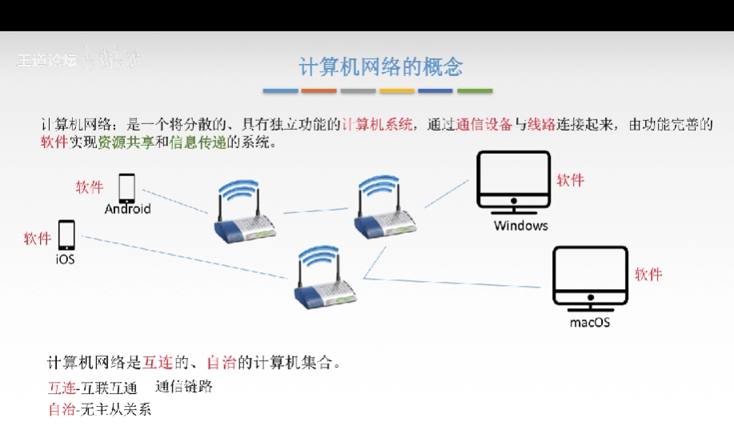
#### 计算机网络的功能
1. 数据通信(连通性) 
2. 资源共享 硬件 软件 数据
3. 分布式处理 hadoop
4. 提高可靠性 替代机
5. 负载均衡 更亲密
#### 计算机网络组成
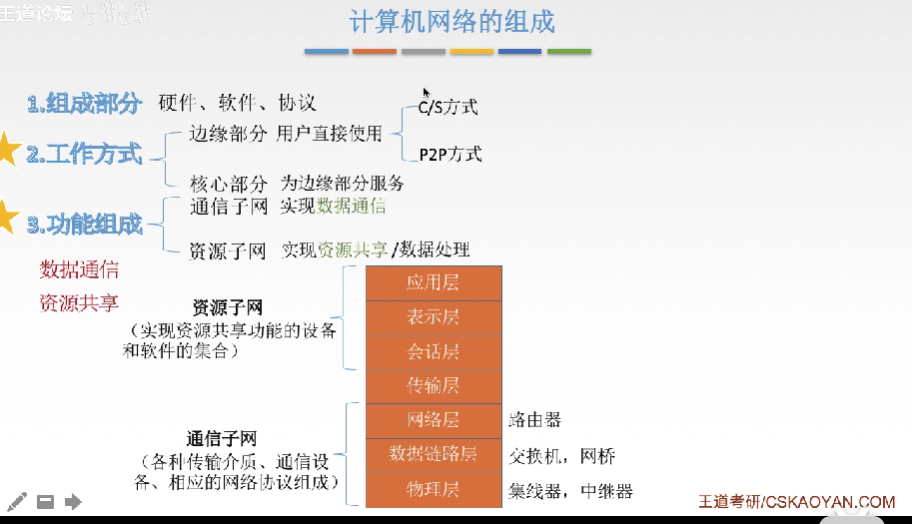
#### 计算机网络分类
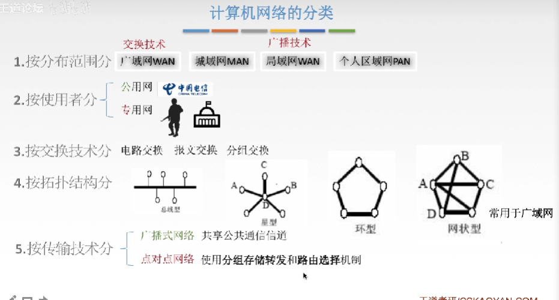
标准化工作及组织
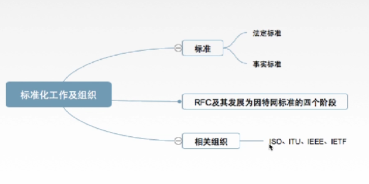
#### 性能指标
1. 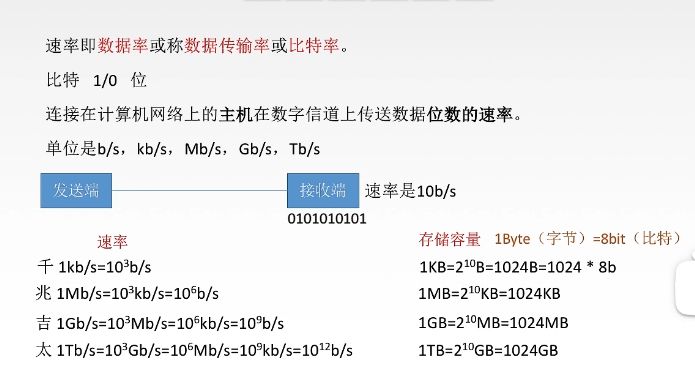
*速率*
2. 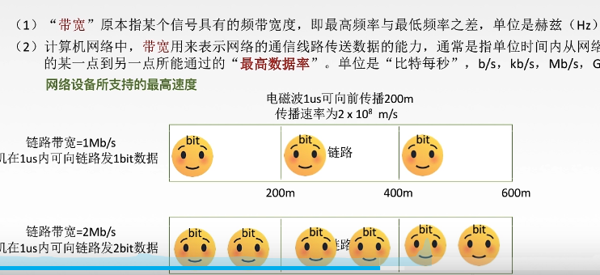
*带宽:注入的数据速率(注意是注入)*
3. 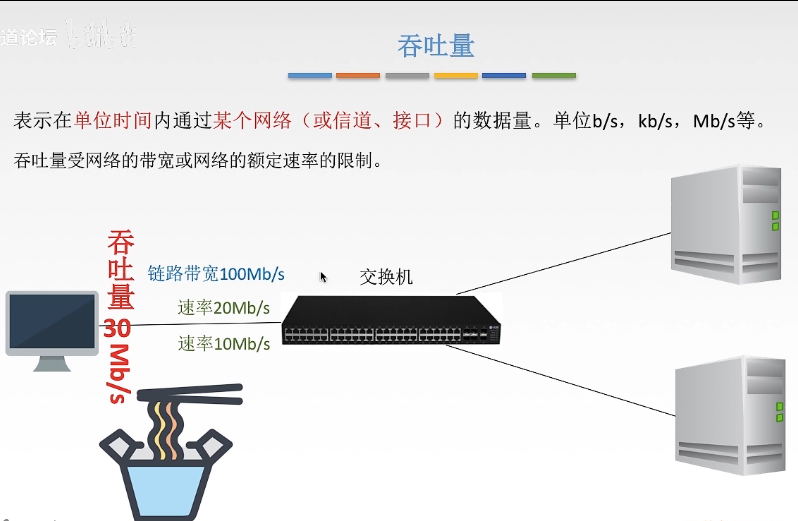
*吞吐量以及和带宽和速率的关系*
4. 时延/延迟
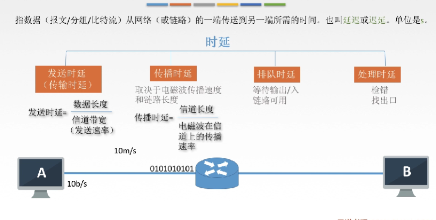
5. 时延带宽积
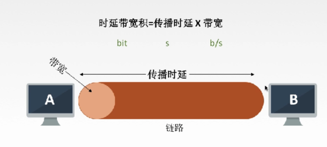
6. 往返时延RTT
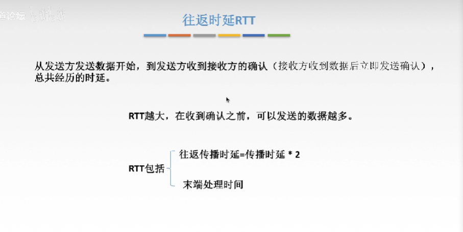
#### 计算机网络的分层结构
###### osi参考模型
物联网淑慧适用
1. 物理层
2. 数据链路层
3. 网络层
4. 运输层
5. 会话层
6. 表示层
7. 应用层
###### tcp/ip参考模型
1. 网络接口层
2. 网际层
3. 传输层
4. 应用层
通信方式不同
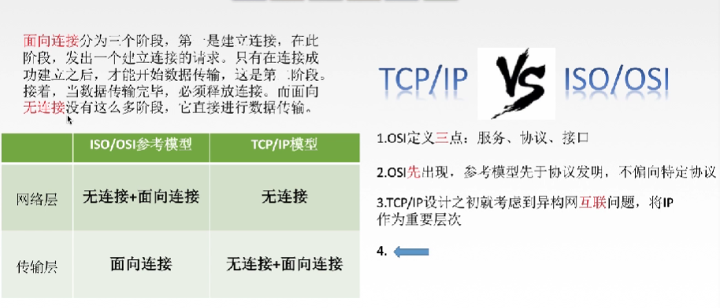
## 第二章
##### 重点
1. 通信基础
2. 两个公式lim
3. 看图说话
4. 传输介质
5. 物理层设备
###### 物理层
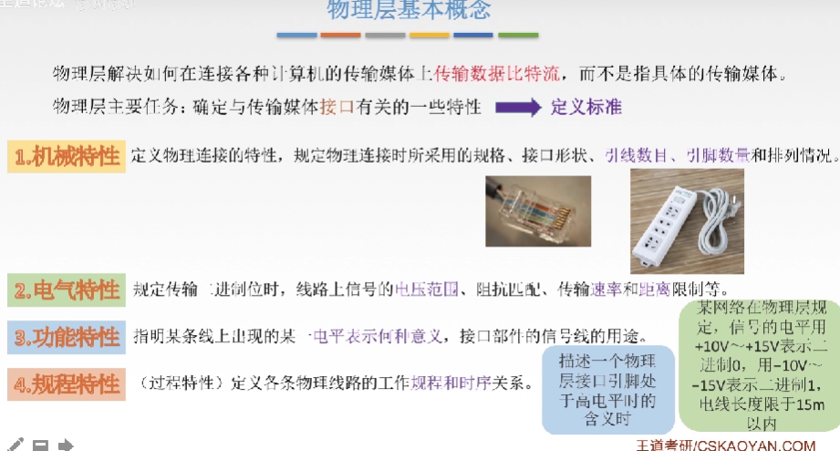
###### 网络层