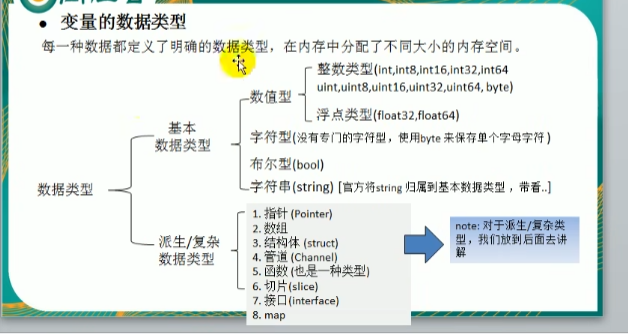

## go
目前环境变量只配置了一个bin其他尚未可知
可以跨平台编译
##### 运行方式
1. go build //编译
2. go run   //不编译直接运行
##### 转义字符
\t \n \\ \" \r
##### 定义变量 先定义后使用原则
//int默认为0 string默认空串
单变量
1. var i int 
var是variable的缩写
1. var i =10     省略int自动推导
2. name :="tom"  省略var
多变量  
1. var n1,n2,n3 int 多变量定义
2. var n1,name,n2=1,"tom",2
3. n1,name,n2:=1,"tom",2
全局变量
1. 
var(
    n1=100
    n4=200
)
1. var n1=100  //一个一个declare
##### 
1. utf-8 汉字三个字节
2. 64位系统int 占8字节
3. 
4. unsafe.sizeof()//变量大小
5. %T %d
6. fmt.Printf fmt.Println
7. 浮点数=符号位+指数位+尾数为 so可能有精度损失
